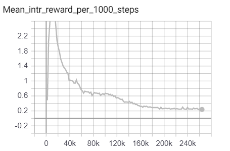

# ICM-PPO-implementation

Experiment with ICM and PPO bunch for environment with sparse reward signal.

## Description

The experiment tests the contribution of [intrinsic reward](https://blogs.unity3d.com/ru/2018/06/26/solving-sparse-reward-tasks-with-curiosity/) to the agent's ability to solve the [sparse-reward environment](https://github.com/Unity-Technologies/ml-agents/blob/master/docs/Learning-Environment-Examples.md#pyramids) from [Unity ML-Agents Toolkit](https://github.com/Unity-Technologies/ml-agents/).

### Results

#### Tensorboard logs for extrinsic and intrinsic rewards

#### Running examples

## Built With

* [Unity ML-Agents Toolkit](https://github.com/Unity-Technologies/ml-agents/).

